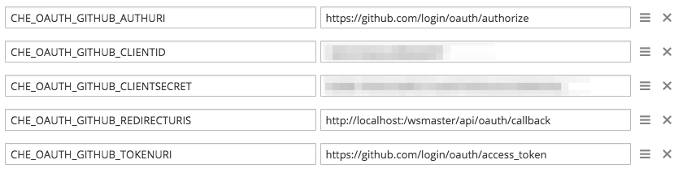
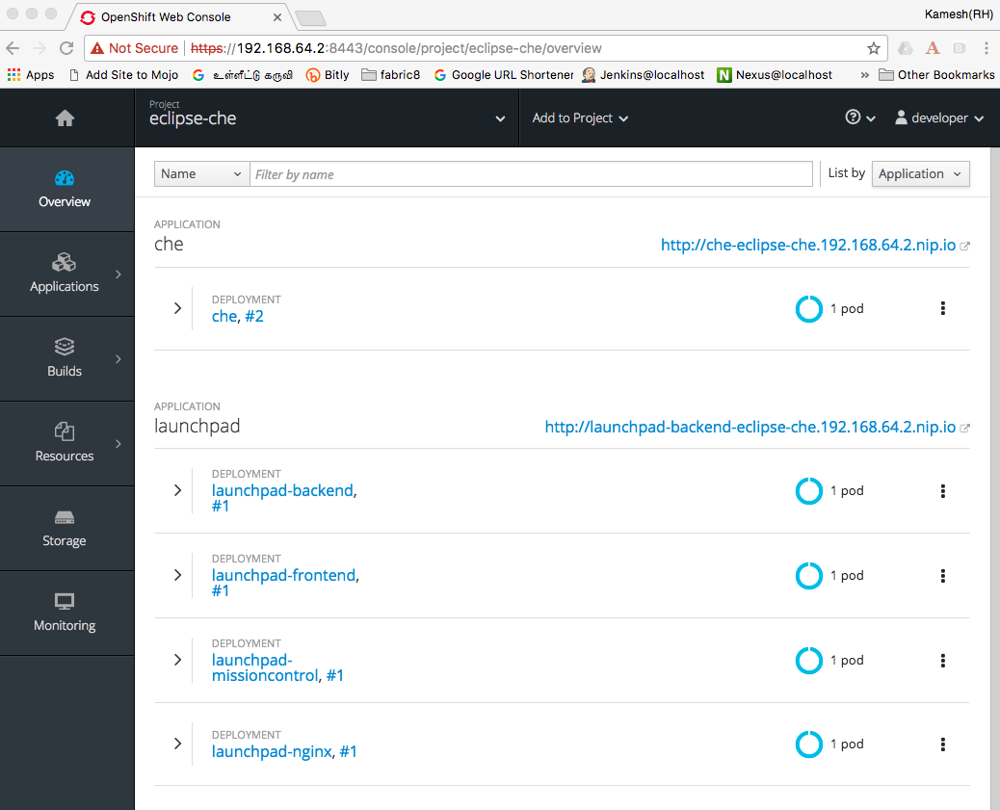

:linkattrs:

:toc: left
:toclevels: 3

= Cloud Workspaces - A new way to Develop and Deploy

https://appdev.openshift.io/[launch.openshift.io] and https://www.eclipse.org/che[Eclipse Che] provides a great develper platform that can help you get started with **Cloud Workspaces**. This demo will show how to get the https://appdev.openshift.io/[launch.openshift.io] and https://www.eclipse.org/che[Eclipse Che] deployed on to,

 * Single-node **OpenShift Cluster** locally using **minishift**

[.text-left]
(**OR**)

 * **OpenShift Cluster** on Cloud

== Pre-requisites 

* Local OpenShift Cluster, https://github.com/minishift/minishift[minishift] is great option
* Access to OpenShift cluster deployed on cloud
* Install jq library locally from https://stedolan.github.io/jq/

== Deployments

The deployment is divided in to following two parts,

* <<deploying-che>> 
* <<deploying-launchpad>> 

Clone the repository github.com/workspace7/cloud-workspaces, let call the location as $PROJECT_HOME

=== Local deployment on minishift

[[deploying-che]]
==== Deploying Che

[code,sh]
----
cd $PROJECT_HOME/scripts
./download_and_run.sh <1>
----

<1> All in one script that does download all the reuqired scripts for the demo and deploy che on to minishift in a project called `eclipse-che`

[NOTE]
====
The timeout of che deployment is set to `120` seconds, this script will increase it to `300` seconds, sometimes `./wait_until_che_is_available.sh` might timeout depending on your local network bandwidth. If throws timeout error , then you can execute `./wait_until_che_is_available.sh && ./replace_stacks.sh` until you see it is sucessfull
====

===== Accessing Che

The che can be accessed using the url `http://che-eclipse-che.<minishift-ip>.nip.io`

[NOTE]
====
The **minishift-ip** can be found using the command `minishift ip`
====

[[github-integration]]
===== Github Integration

Once you have the Che deployed and running, you should now enable it for GitHub intgeration.  To enable Github integration you need to have created a oAuth2 App token in Github, please refer to https://developer.github.com/apps/building-integrations/setting-up-and-registering-oauth-apps/registering-oauth-apps/[Registering OAuth Apps].

Once you have the oAuth2 registration done, add the oAuth2 client id to local environment variable called `CHE_OAUTH_GITHUB_CLIENTID` and oAuth2 client secret to localenvironment variable called `CHE_OAUTH_GITHUB_CLIENTSECRET`.

IMPORTANT: Please ensure that the environment variables are available before running the script `enable_github_oauth.sh`

[NOTE]
====
The **Authorization callback URL** should be set to `https://che-<your-openshift-project>-<minishift-ip>.nip.io/wsmaster/api/oauth/callback`, where **minishift-ip** can be found using the command `minishift ip`

e.g. 
With your minishift ip is `192.168.64.2` and you are deploying to a project called `eclipse-che` then your **Authorization callback URL** will be `http://che-eclipse-che.192.168.64.2.nip.io/wsmaster/api/oauth/callback`
====

Once you have setup your github oAuth2, you are all set to configure che with Github integration once you run the following command.

[code,sh]
----
export CHE_OAUTH_GITHUB_CLIENTID='your-gituhub-aouth2-client-id'<1>
export CHE_OAUTH_GITHUB_CLIENTSECRET='your-gituhub-aouth2-client-id'<1>

./enable_github_oauth.sh <2>
----

<1> If you not set the environment variables as mentioned in <<github-integration>>, you need to set the **CHE_OAUTH_GITHUB_CLIENTID** and **CHE_OAUTH_GITHUB_CLIENTSECRET**  to Github oAuth2 `clientid` and `client-secret`, before running the github integration script
<2> the github integration enabler script 

Please note this command will trigger redeployment of che with extra environment variables needed for github integration. You can check the availability of che using `$PROJECT_HOME/wait-che.sh` command

The updated che deployment config will have the following addtional ENV variables ,

IMPORTANT: Sometimes your browser might have logged into one of your github accounts, to avoid conflicts we will use incognito mode when accessing che.

For more details on VCS integration with Che please refer http://www.eclipse.org/che/docs/ide/git-svn/index.html#github-oauth[here]

[[deploying-launchpad]]

==== Github Personal Access Token

You can obtain a personal access token from https://github.com/settings/tokens, please ensure that the scopes of the token has the following permissions,

* repo
* admin:repo_hook

TIP: You can store the personal access token locally via some environment variable like $LAUNCHPAD_GITHUB_TOKEN, as token can be seen only once

====  Deploying launch.openshift.io

The LauchPad helps us to create project from template and needed runtime. To deploy launch.openshift.io execute the following command,

[code,sh]
----
./deploy_launchpad_mission.sh -p <your-openshift-project> -i developer:developer -g <your-github-user>:<your-github-personal-access-token>
----
(e.g.)
Assuming that you have defined two variables `LAUNCHPAD_GITHUB_USERNAME` to your github user id and `LAUNCHPAD_GITHUB_TOKEN` to the personal acfess token crated via 
----
./deploy_launchpad_mission.sh -p eclipse-che -i developer:developer -g $LAUNCHPAD_GITHUB_USERNAME:$LAUNCHPAD_GITHUB_TOKEN
----

==== Accessing launch.openshift.io 

Wait for all launch.openshift.io pods to come up, once they are up you can acess the launchpad ui `http://launchpad-nginx-eclipse-che.<minishift-ip>.nip.io/wizard`

[NOTE]
====
The **minishift-ip** can be found using the command `minishift ip`
====

The detail installation instuctions of installing "launch.openshift.io" is available https://appdev.openshift.io/docs/minishift-installation.html[here]

A sucessfull deployment will have OpenShift console like shown below,

==== Cleanup 

[code,sh]
----
./deploy_che.sh --command cleanup
----

== Troubleshooting

=== H2 DB lock issue

* Somtimes the che workspaces might now comeup correctly post redeployment, please check the logs of che using `oc logs -f che -n <your-project>` if you see any DB related exception traces, then it means the `H2` database has not released the lock properly. To overcome this just scale down the che using command `oc scale dc che --replicas 0`, wait until che pod is killed, checked using command `oc get pods -w -n <your-openshift-project>`. Once the existing pod is killed, scale up the che pod again using the command `oc scale dc che --replicas 1`, check che status using `$PROJECT_HOME/wait-che.sh` command.

